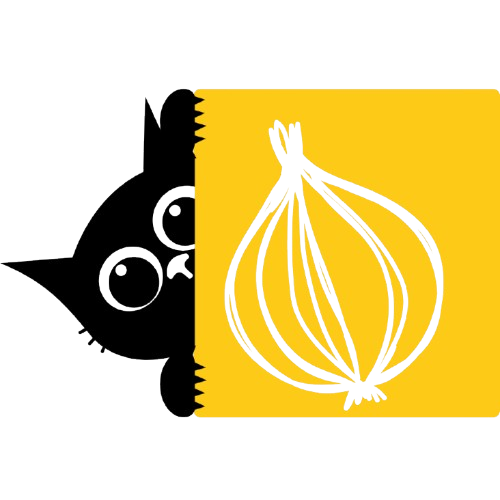

<div align="center">



# onion

**A Jira-style project management tool — boards, backlog, sprints, and issue detail.**


</div>

---

> **Status: UI-first, mock data.** Every screen is fully functional and
> clickable, but all data lives in an in-memory mock layer. There is no
> backend, no `fetch`/`axios` calls, and no environment variables yet. See
> [Current limitations](#current-limitations) below before assuming any
> behavior is production-ready.

## Overview

`onion` lets you browse projects, work a Kanban board with drag-and-drop,
groom a filterable backlog, and open an issue's full detail — description,
status, assignee, priority, and comments — all without a server. The data
layer is deliberately shaped like a real API client (see
[Architecture](#architecture)) so a backend can be dropped in later with
minimal churn.

## Features

- **Project dashboard** — browse projects with lead, description, and
  completion progress
- **Kanban board** — status columns driven by drag-and-drop
  (`@dnd-kit`), with optimistic updates
- **Backlog** — a sortable, drag-to-reorder issue list, filterable by
  status, assignee, and priority
- **Issue detail** — a shareable `?issue=KEY` dialog with description,
  status/assignee/priority editing, story points, labels, and threaded
  comments
- **Top navigation** — project switcher and a mock signed-in user menu

## Tech stack

| Concern           | Choice                              |
| ------------------ | ------------------------------------ |
| Framework          | React + TypeScript, built with Vite |
| Styling             | Tailwind CSS                        |
| UI components       | shadcn/ui                           |
| Routing             | React Router                        |
| Drag and drop       | `@dnd-kit/core` + `@dnd-kit/sortable` |
| Data fetching       | TanStack Query, backed by mock resolvers |

## Getting started

### Prerequisites

- Node.js 20 or later
- npm

### Install

```bash
npm install
```

### Start

```bash
npm run dev -- --host
```

This starts the Vite dev server at `http://localhost:5173`. The `--host`
flag also exposes it on your local network (printed in the terminal as a
`Network:` URL) so you can test from another device.

### Stop

Press `Ctrl+C` in the terminal running the dev server.

### Other commands

| Command           | Purpose                                    |
| ------------------ | ------------------------------------------- |
| `npm run build`    | Type-check with `tsc`, then production build |
| `npm run preview`  | Serve the production build locally          |
| `npm run lint`     | Run oxlint                                   |

## Project structure

```
src/
  types/        Domain interfaces: Issue, Project, User, Status, Sprint, Comment, etc.
  mocks/        Static, typed mock data (users, projects, statuses, sprints, issues, comments)
  services/     Mock "data service" layer — issueService, projectService, userService,
                commentService. Functions here (getIssues, updateIssueStatus, ...) have
                the same shape a real API client would have; db.ts holds the in-memory
                store they read/write and simulates network latency. This is the seam
                to swap in real HTTP calls later — component/hook code shouldn't need
                to change.
  hooks/        Cross-cutting TanStack Query hooks (projects, users, statuses, sprints)
  features/     One folder per feature area, each owning its query hooks and components:
    board/          Kanban board (columns per status, drag-and-drop via @dnd-kit)
    backlog/        Sortable, filterable flat issue list
    issue-detail/   Issue detail dialog (description, status/assignee/priority, comments)
    projects/       Project list / dashboard
  components/
    ui/          shadcn/ui primitives (button, dialog, dropdown-menu, select, tabs, ...)
    layout/      App shell, top nav, project switcher, user menu
    common/      Small shared display components (avatars, priority/type icons)
  routes/        React Router route tree (routes/router.tsx) and the project layout
                 (board/backlog tabs) that wraps board & backlog pages
  lib/           QueryClient instance and query key registry
```

## Architecture

Every screen reads through a TanStack Query hook (e.g. `useBoardIssues`,
`useBacklogIssues`, `useProjects`) whose `queryFn` calls a function in
`src/services/`. Mutations — drag-and-drop status changes, backlog
reordering, editing an issue, adding a comment — go through the same
service functions and use optimistic updates via the query cache.

To wire up a real backend later: replace the bodies of the functions in
`src/services/*.ts` with real HTTP calls, keeping their signatures intact,
then delete `src/services/db.ts` and the mock data under `src/mocks/`. No
component or hook code should need to change.

The issue detail dialog is driven by a `?issue=<KEY>` search param
(`useIssueDetailRoute`), not a route param, so it's shareable/bookmarkable
and opens the same way from both the board and the backlog.

## Current limitations

Worth knowing before extending this further:

- **No persistence.** All state lives in memory; a page refresh resets
  every mutation back to the seed data in `src/mocks/`.
- **No authentication.** The "signed-in" user in the top nav is a fixed
  mock user, not a real session.
- **One shared workflow.** Every project uses the same four statuses
  (To Do / In Progress / In Review / Done); per-project workflow
  customization isn't modeled yet.
- **No automated tests.** There is no test runner configured — changes are
  currently verified manually in the browser.
- **Not code-split.** The production bundle is a single chunk; if the app
  grows, consider route-based `import()` splitting.

## License

No license has been chosen yet for this project.
